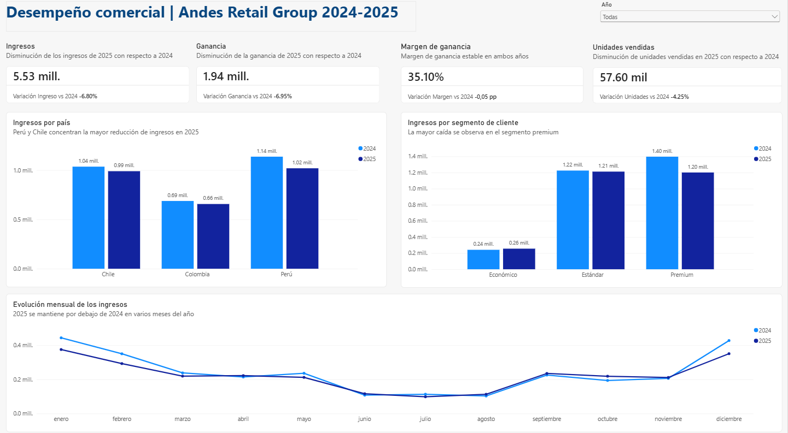
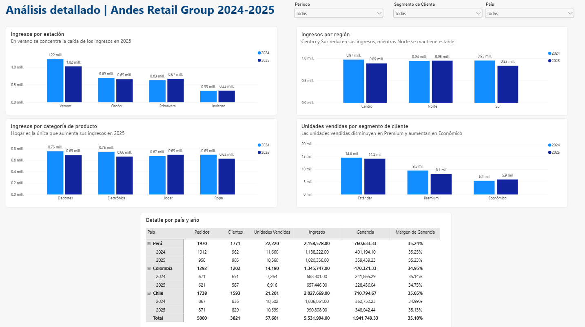

# 📊 Andes Retail Group | Análisis de desempeño comercial 2024–2025

## Descripción

Análisis del desempeño comercial de **Andes Retail Group** durante 2024 y 2025, con operaciones en Perú, Chile y Colombia.

El objetivo del proyecto es comparar el desempeño entre ambos años e identificar en qué países, segmentos de clientes, regiones, estaciones y categorías de producto se concentran las principales variaciones en ingresos.

El reporte fue desarrollado en **Power BI** y está compuesto por una vista ejecutiva y una vista de análisis detallado.

## 🛠️ Herramientas y habilidades

- Power BI
- Power Query
- DAX
- Transformación y preparación de datos
- Visualización de datos
- Análisis de negocio
- Data storytelling

## 🎯 Preguntas de negocio

- ¿Cómo evolucionaron los ingresos entre 2024 y 2025?
- ¿Cómo cambió la ganancia y el margen de ganancia?
- ¿Qué países concentran las principales variaciones de ingresos?
- ¿Qué segmentos de clientes presentan los mayores cambios?
- ¿Qué categorías de producto muestran un mejor o peor desempeño?
- ¿Existen diferencias relevantes por región o estación?
- ¿Qué patrones se observan a lo largo del año?

## 📈 Dashboard ejecutivo



La vista ejecutiva resume el desempeño comercial mediante indicadores de ingresos, ganancia, margen de ganancia y unidades vendidas, además de comparaciones por país, segmento de cliente y mes.

### Principales hallazgos

- Los ingresos totales del periodo analizado ascienden a **5.53 millones** y en 2025 disminuyen **6.80%** respecto a 2024.
- La ganancia disminuye **6.95%** en 2025.
- El margen de ganancia se mantiene prácticamente estable, alrededor de **35.10%**.
- Las unidades vendidas disminuyen **4.25%**.
- Perú y Chile concentran las mayores reducciones de ingresos entre ambos años.
- El segmento **Premium** presenta la caída de ingresos más marcada entre los segmentos analizados.

## 🔎 Análisis detallado



La segunda vista permite profundizar en las dimensiones donde se concentran las variaciones observadas en el desempeño general.

### Hallazgos por dimensión

**Estacionalidad.** La mayor reducción de ingresos se observa en verano.

**Regiones.** Centro y Sur reducen sus ingresos, mientras que Norte se mantiene relativamente estable.

**Categorías de producto.** Hogar es la única categoría que incrementa sus ingresos en 2025; Deportes, Electrónica y Ropa presentan reducciones.

**Segmentos de clientes.** Las unidades vendidas disminuyen en Premium y aumentan en el segmento Económico.

## 💡 Conclusiones

El análisis muestra una contracción del desempeño comercial en 2025, reflejada tanto en ingresos como en ganancia y unidades vendidas. Sin embargo, el margen de ganancia permanece prácticamente estable, por lo que la reducción de ingresos no está acompañada por un deterioro relevante del margen.

Las variaciones no se distribuyen de manera uniforme: se concentran especialmente en determinados países, regiones, estaciones y segmentos de clientes. El segmento Premium destaca por la reducción tanto de ingresos como de unidades vendidas, mientras que la categoría Hogar presenta un comportamiento distinto al resto al incrementar sus ingresos.

Estos resultados permiten orientar análisis posteriores hacia las causas de la reducción de ventas en los segmentos con mayor caída y explorar las características de las áreas que mostraron mayor estabilidad o crecimiento.

## 📂 Archivos del proyecto

```text
andes-retail-powerbi/
│
├── README.md
├── Andes_Retail_Analysis.pbix
└── images/
    ├── dashboard-overview.png
    └── dashboard-detail.png
```

El archivo `Andes_Retail_Analysis.pbix` contiene el reporte desarrollado en Power BI. El dataset original no se incluye en este repositorio.

## 👩‍💻 Autora

**Tania Cruz**  
 Data Analyst
